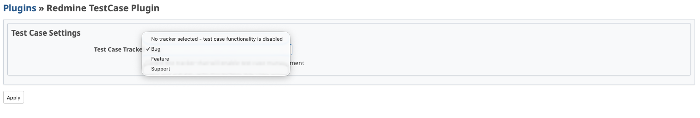
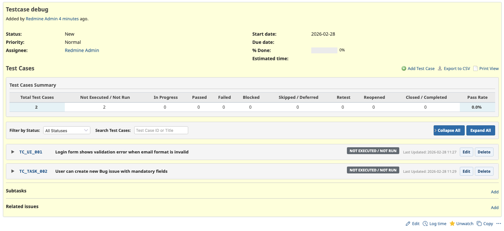
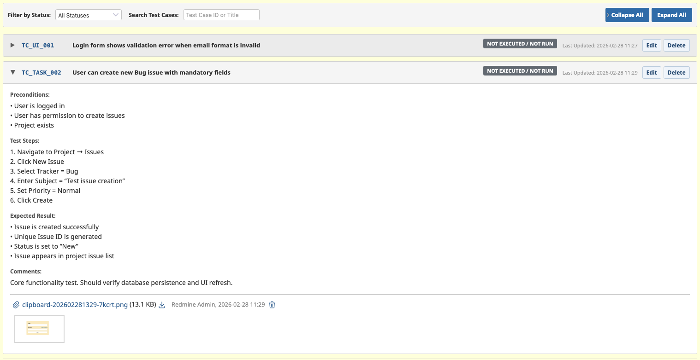
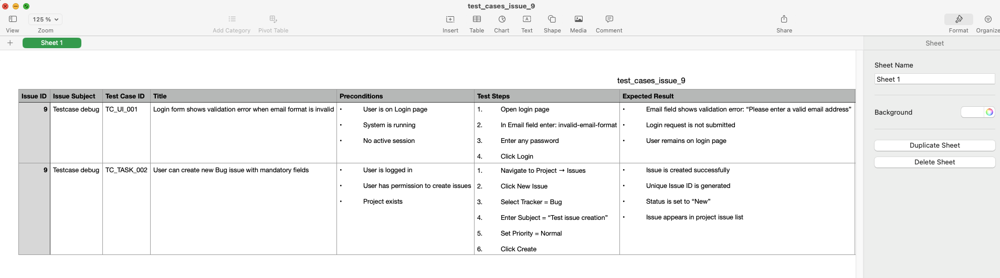
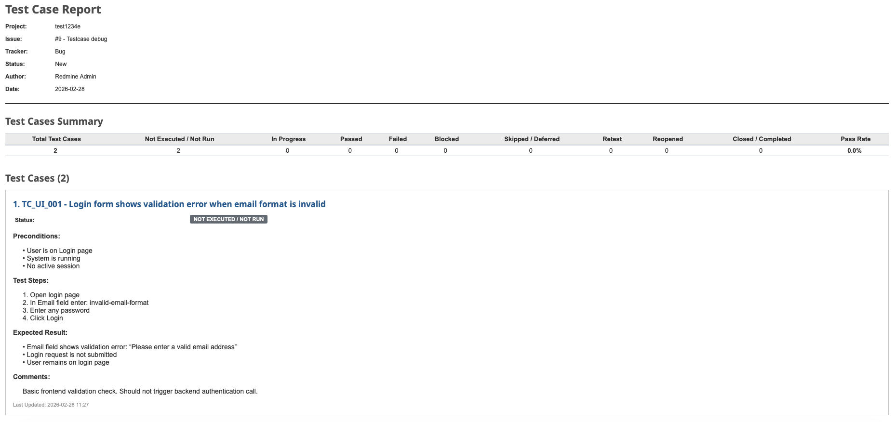

# Redmine TestCase Plugin


A Redmine plugin for managing manual test cases within issues.

## Features

- Add and manage test cases within specific issue trackers
- Configurable tracker selection for QA functionality
- Collapsible test case UI with detailed fields
- Export test cases to CSV
- Print-friendly HTML view for PDF generation
- Status workflow tracking

## Installation

1. Copy the plugin directory to your Redmine `plugins` folder:
   ```bash
   cd /path/to/redmine/plugins
   cp -r /path/to/redmine_testcase .
   ```

2. Run the plugin migrations:
   ```bash
   cd /path/to/redmine
   bundle exec rake redmine:plugins:migrate RAILS_ENV=production
   bundle exec rake assets:precompile
   ```

3. Restart your Redmine instance:
   ```bash
   # For Passenger
   touch tmp/restart.txt

   # For other servers, restart accordingly
   ```

4. Log in to Redmine as an administrator

5. Go to **Administration → Plugins** to verify the plugin is loaded

6. Go to **Administration → Plugins → Redmine TestCase Plugin → Configure** to select the tracker that will enable test case management

## Configuration



1. Navigate to **Administration → Plugins**
2. Find "Redmine TestCase Plugin" and click **Configure**
3. Select the tracker you want to enable for test case management (e.g., "TestCase")
4. Save settings

## Usage



1. Create or open an issue with the configured tracker
2. Click the **Test Cases** tab
3. Use **Add Test Case** to create new test cases
   
4. Each test case includes:
   - Test Case ID (e.g., TC_UI_001)
   - Title
   - Preconditions
   - Test Steps
   - Expected Result
   - Actual Result
   - Status
   - Comments
   
5. Use **Export CSV** to download all test cases
   
6. Use **Print View** to generate a printer-friendly report
   

## Test Case Statuses

- Not Executed / Not Run
- In Progress
- Passed
- Failed
- Blocked
- Skipped / Deferred
- Retest
- Reopened
- Closed / Completed

## Compatibility

Tested successfully on Redmine 6.1.X and 6.0.X.

| Locale | Status |
|--------|--------|
| en     | Full support |
| lt     | Full support |
| de     | Not supported |
| es     | Not supported |
| fr     | Not supported |
| it     | Not supported |
| ja     | Not supported |
| ru     | Not supported |

## Upgrade

```bash
cd /path/to/redmine
bundle exec rake redmine:plugins:migrate RAILS_ENV=production
touch tmp/restart.txt
```

## Uninstall

```bash
cd /path/to/redmine
bundle exec rake redmine:plugins:migrate NAME=redmine_testcase VERSION=0 RAILS_ENV=production
rm -rf plugins/redmine_testcase
touch tmp/restart.txt
```

## Support

For issues and feature requests, please visit: [GitHub Issues](https://github.com/jonasliu95/redmine_testcase/issues)

Improvements are widely accepted! If you have any suggestions, bug reports, or translation updates, please open an issue in GitHub.

## License

This plugin is released under the MIT License.
